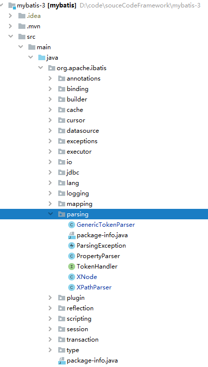
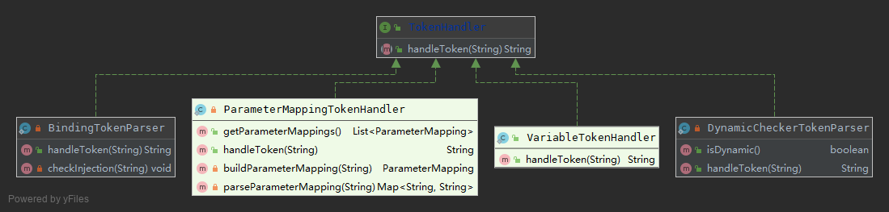

解析器模块

[toc]

## 1. 概述

### 1.1 结构图




### 1.2 功能

`parsing`是 MyBatis 的解析器模块，主要提供两个主要功能：

- 通过对 `XPath`进行封装，为 MyBatis 初始化解析 `mybatis-config.xml`配置文件以及映射配置文件提供支持。
- 处理动态 SQL 中的占位符提供支持。

## 2. 解析

### 2.1 ParsingException

|                             类图                             |    说明    |
| :----------------------------------------------------------: | :--------: |
|  | 解析器异常 |

### 2.2 TokenHandler

`org.apache.ibatis.parsing.TokenHandler`是处理 Token 的接口，代码如下：

```java
/**
 * Token 处理接口
 */
public interface TokenHandler {

  /**
   * 处理 Token
   *
   * @param content
   * @return
   */
  String handleToken(String content);
}
```

#### 2.2.1 UML 图



### 2.3 VariableTokenHandler


### 2.4 XPathParser

`org.apache.ibatis.parsing.XPathParser`是基于 Java Xpath 的解析器，用于解析 MyBatis 的`mybatis-config.xml`和 `**Mapper.xml`等 XML 配置文件。

```java
/**
 * XPath 解析器
 *
 * @author Clinton Begin
 * @author Kazuki Shimizu
 */
public class XPathParser {

  /**
   * XML Document 对象
   * XML 解析后，生成该对象
   */
  private final Document document;
  /**
   * 是否校验
   */
  private boolean validation;
  /**
   * XML 实体解析器
   */
  private EntityResolver entityResolver;
  /**
   * 变量 Properties 对象
   * 用于替换需要动态替换的属性值
   */
  private Properties variables;
  /**
   * Java XPath 对象
   * 用于查询 XML 中的节点与元素
   */
  private XPath xpath;
}
```


### 2.5 XNode

